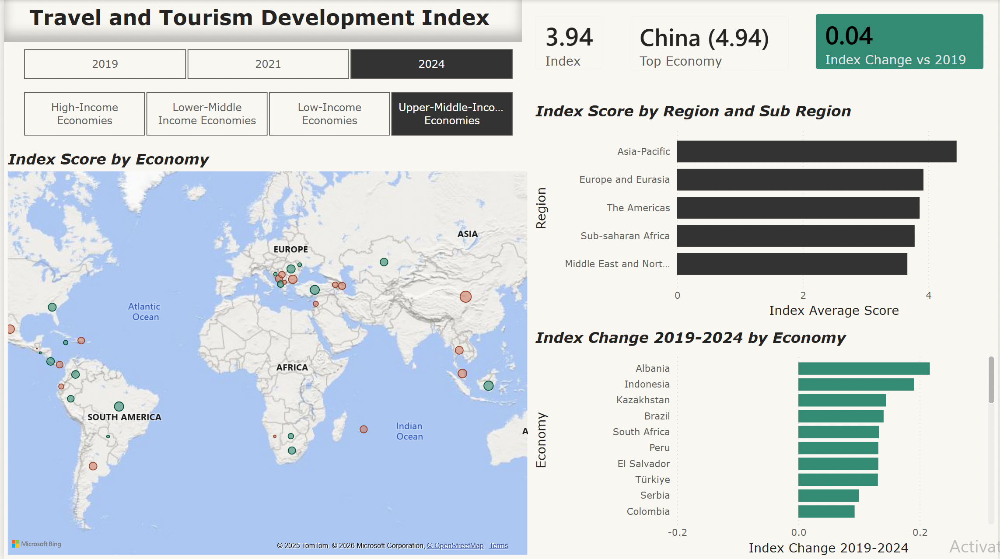
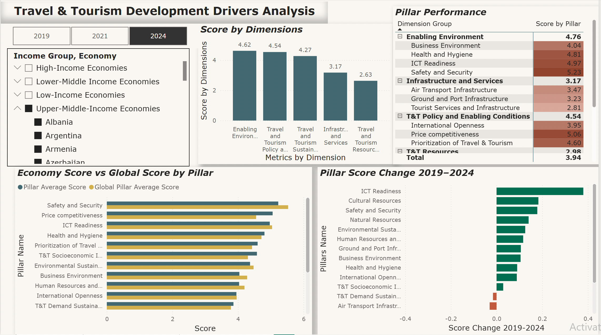
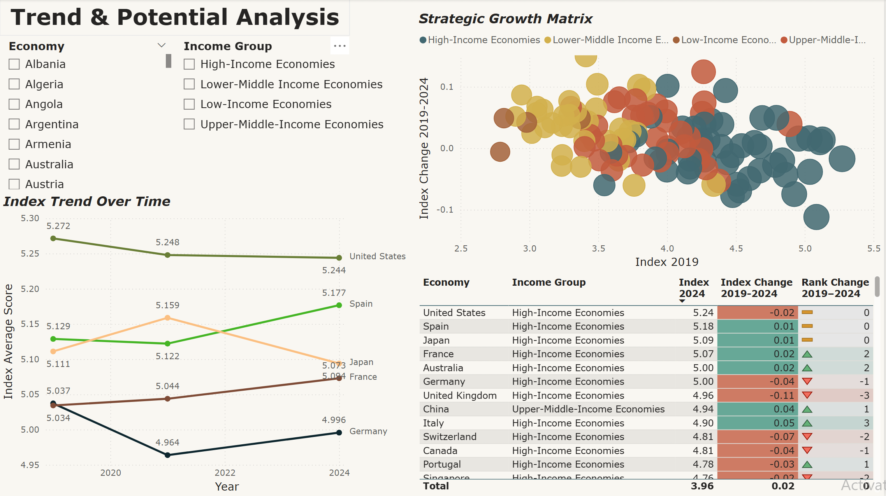

# Travel & Tourism Development Index (TTDI) Analytics Dashboard

## 📌 Project Overview
This project presents a comprehensive, multi-layered Power BI dashboard analyzing the **Travel & Tourism Development Index (TTDI)**. Utilizing data from the World Economic Forum, the report evaluates the competitiveness and resilience of over 100 economies.

The core objective is to analyze industry recovery in the post-pandemic era by benchmarking **2024 performance against 2019 (Pre-pandemic peak)** and **2021 (Crisis period)**, identifying structural drivers of growth and high-potential destinations.

---

## 📊 Dashboard Structure & Business Logic

### Page 1: Global Overview (Macro Analysis)
* **Objective**: Monitor the current state of global tourism competitiveness.
* **Key Features**: 
    * **Geospatial Analysis**: Interactive map visualizing Index scores and growth status (Green for growth, Red for decline).
    * **KPI Tracking**: Real-time cards displaying global/regional average scores and top-performing economies.
    * **Comparative Analysis**: Clustered bar charts visualizing regional rankings and absolute score changes since 2019.

### Page 2: Dimension & Pillar Drivers (Root Cause Diagnosis)
* **Objective**: Drill down into the specific "Why" behind a country's ranking.
* **Key Features**:
    * **Hierarchy Navigation**: Seamless exploration from 5 Dimensions down to 17 specialized Pillars.
    * **Dynamic Benchmarking**: A "Gap Analysis" visual comparing individual country performance against a **Global Average Baseline** using advanced DAX filter context.
    * **Heatmap Matrix**: Conditional formatting used to instantly identify strengths and weaknesses across the TTDI hierarchy.

### Page 3: Trend & Potential Analysis (Strategic Growth)
* **Objective**: Identify "Rising Stars" and future investment opportunities.
* **Key Features**:
    * **Strategic Growth Matrix**: A four-quadrant scatter chart plotting **2019 Base Score** vs. **2019-2024 Growth Rate** to isolate high-potential economies.
    * **Relative Competitiveness**: A "Rank Jumper" table showing economies with the highest upward mobility in global rankings.
    * **V-Shape Recovery Tracking**: Longitudinal line charts comparing recovery trajectories across different Income Groups.

---

## 🛠️ Technical Implementation

### 1. Data Engineering & Transformation
* **Complex Cleaning**: Transformed a nested, multi-header raw Excel structure into a clean, **Long Format** dataset using Power Query.
* **Unpivot Logic**: Pivot/Unpivot operations applied to handle temporal data (2019, 2021, 2024) across 100+ indicators.
* **Star Schema**: Implemented a robust data model with a central `Fact_TTDI` table connected to normalized dimensions (`Dim_Economy`, `Dim_Metrics`).

### 2. Advanced DAX Calculations
* **Measure Branching**: Built a scalable library of measures to calculate Year-specific scores, historical benchmarks, and variances.
* **Context Transition**: Utilized `CALCULATE`, `REMOVEFILTERS`, and `ALLSELECTED` to build dynamic global averages that remain stable regardless of country-specific slicers.
* **Dynamic Ranking**: Implemented `RANKX` with `DENSE` logic to provide accurate competitive positioning across different years and metric levels.

---

## 📂 Repository Contents
* `TTDI_2024_Dashboard.pbix`: The core Power BI report file.
* `WEF_TTDI_2024_edition_data.xlsx`: Processed datasets used for the analysis.
* `Screenshots.png`: High-resolution images of the three dashboard pages.

## 💡 How to Use
1. Clone this repository or download the `.pbix` file.
2. Open with **Power BI Desktop**.
3. Use the **Year Slicer** and **Economy Group Slicer** on the Overview page to toggle between pre-pandemic and current snapshots.

---
**Developed by**: Mengyuan Li  
**Professional Links**: [LinkedIn Profile](https://www.linkedin.com/in/mengyuanli0802)
